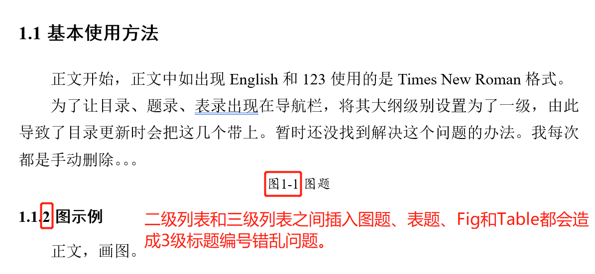
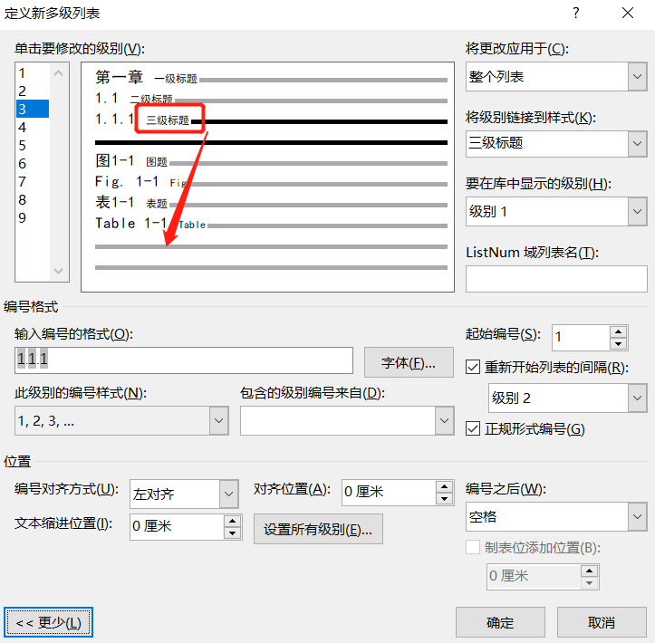
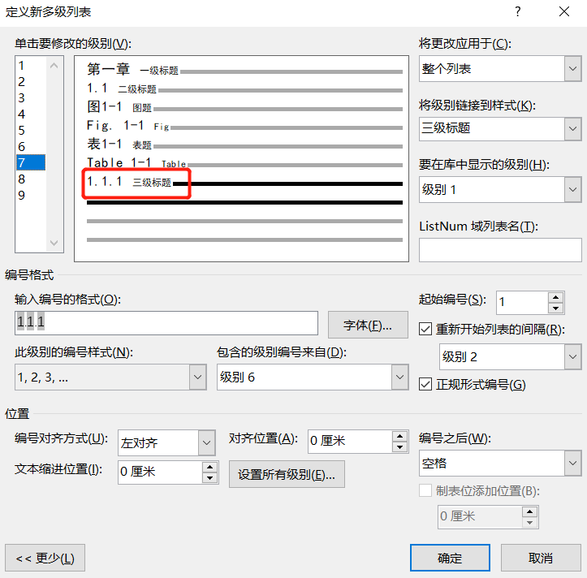
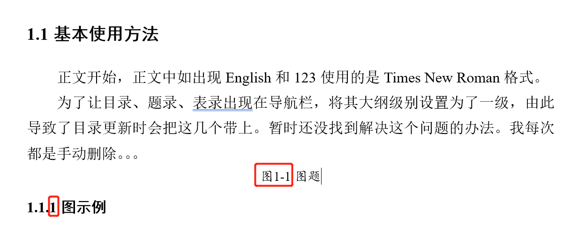

# SJTU-thesis-template
上海交通大学研究生学位论文模板，博士和硕士通用。

## 制作说明
上海交通大学研究生院对于硕士、博士学位论文的要求可以参见[上海交通大学博士、硕士学位论文撰写指南](https://www.gs.sjtu.edu.cn/info/1143/5801.htm)。机动学院在[网站](http://me.sjtu.edu.cn/YanJS/degreemanage.html)上给出了一个更为详细的参考:[机械与动力工程学院 研究生学位论文参考格式](http://me.sjtu.edu.cn/YanJS/upload/LWGS.doc)。安泰学院制作了更为易用的论文模板：[上海交通大学硕士学位论文格式模板.doc](http://www.acem.sjtu.edu.cn/master/download/20139.html)。本模板的制作参考了以上要求和文件。

学校研究生院于2021年5月21日发布了一个[官方模板](https://www.gs.sjtu.edu.cn/info/1136/8374.htm)，大家可以参考一下。

## 亮点
1. 支持标题自动编号、正文页眉奇偶页不同并自动抓取对应的章节标题；
1. 图题表题等内容以样式+多级列表的思路实现，操作方便，可以自动编号并收录于目录后面的图录、表录。

欢迎个人使用和分享，请勿商用。使用过程中如有问题、建议和反馈，欢迎发邮件至zhangzhanluo@sjtu.edu.cn交流。

## 制作人
ZHANGZHANLUO 2019年11月26日于iDesignLab

## 版本修改记录
### 三级标题编号错误问题
2021年6月1日
#### 问题描述
当二级三级标题之间插入图题、标题、Fig和Table等内容时会导致其后的三级标题编号错误。如下图所示：

#### 解决思路

目前的图题表题等内容是使用样式+多级列表的方式实现的。重新观察多级列表，提出猜想：出现该问题的原因是三级标题在多级列表的位置错误了，应当放在最后。

修改上述多级列表，把三级标题调到最后，相关设置均保持不变。

修改后再次测试，问题得到解决。

